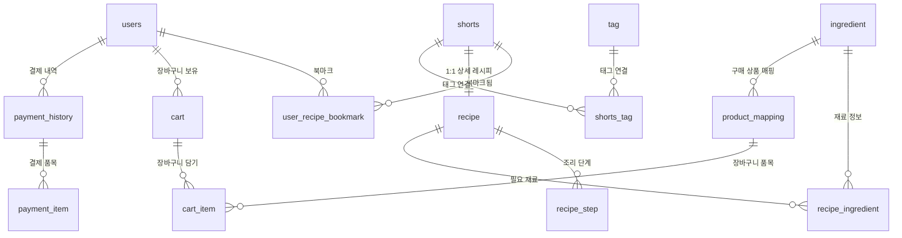

# 🍳 혼밥다이어리 (Honbab Diary) 데이터베이스 스키마 가이드

혼밥다이어리 서비스의 PostgreSQL 데이터베이스 스키마 구조, 테이블 간 연관관계(ERD), 그리고 서비스 내 데이터 흐름을 설명하는 문서입니다.

---

## 📌 1. 전체 ERD (Entity Relationship Diagram)



---

## 🏗️ 2. 도메인별 테이블 상세 설명

총 15개의 테이블은 서비스 기능에 따라 **5대 핵심 도메인**으로 구분됩니다.

```
┌─────────────────────────────────────────────────────────────┐
│ 1. 사용자 & 인증     : users, user_recipe_bookmark          │
│ 2. 쇼츠 & 레시피     : shorts, tag, shorts_tag,             │
│                        recipe, recipe_step                  │
│ 3. 식재료 & 커머스   : ingredient, recipe_ingredient,       │
│                        product_mapping                      │
│ 4. 장바구니 & 결제   : cart, cart_item,                     │
│                        payment_history, payment_item        │
│ 5. 시스템 인프라     : flyway_schema_history                │
└─────────────────────────────────────────────────────────────┘
```

---

### 도메인 1. 사용자 & 인증 (User & Auth)

#### 1. `users` (회원 정보)
- **용도**: 카카오 소셜 로그인 등으로 가입한 사용자 계정 정보를 저장합니다.
- **주요 컬럼**:
  - `id` (PK): 사용자 고유 번호
  - `email`: 사용자 이메일 (Unique)
  - `nickname`: 닉네임
  - `profile_image_url`: 프로필 사진 URL
  - `oauth_provider` / `oauth_id`: 소셜 로그인 공급자(예: `KAKAO`) 및 식별 ID

#### 2. `user_recipe_bookmark` (레시피 북마크/즐겨찾기)
- **용도**: 사용자가 마음에 드는 쇼츠 레시피를 보관함에 저장할 때 사용합니다.
- **연결 관계**:
  - `user_id` ➔ `users.id` (N:1)
  - `shorts_id` ➔ `shorts.id` (N:1)
- **특징**: `(user_id, shorts_id)` 복합 유니크 키로 한 사용자가 동일 쇼츠를 중복 북마크할 수 없습니다.

---

### 도메인 2. 쇼츠 & 레시피 (Shorts & Recipe)

#### 3. `shorts` (유튜브 쇼츠 메타데이터)
- **용도**: 유튜브에서 크롤링한 혼밥/자취 요리 쇼츠 영상 정보입니다.
- **주요 컬럼**:
  - `youtube_id`: 유튜브 영상 고유 ID (예: `dQw4w9WgXcQ`, Unique)
  - `title`: 영상 제목
  - `channel_name`: 유튜브 채널명
  - `thumbnail_url` / `video_url`: 썸네일 및 재생 링크
  - `duration_seconds`: 영상 길이 (초)
  - `view_count`: 조회수 (인기순 정렬 인덱스 적용)
  - `status`: 영상 상태 (`ACTIVE`, `INACTIVE` 등)

#### 4. `tag` & `shorts_tag` (해시태그 다대다 매핑)
- **용도**: 영상의 태그(#혼밥, #초간단, #에어프라이어 등)를 관리합니다.
- **연결 구조**:
  - `shorts` (1) ➔ `shorts_tag` (N:M 중간 테이블) ➔ `tag` (1)

#### 5. `recipe` (상세 레시피)
- **용도**: 쇼츠 영상에서 추출한 실제 요리 레시피 정보입니다.
- **연결 관계**: `shorts_id` ➔ `shorts.id` (**1:1 관계**, 영상 하나당 상세 레시피 1개)
- **주요 컬럼**:
  - `title`, `description`: 요리명 및 한줄 설명
  - `serving_size`: 몇 인분인지 (기본 1인분)
  - `prep_time_minutes`, `cook_time_minutes`: 준비/조리 시간
  - `difficulty`: 난이도 (`EASY`, `NORMAL`, `HARD`)
  - `estimated_cost`: 예상 재료비
  - `nutrition_info`: 칼로리/영양성분 (JSONB)

#### 6. `recipe_step` (조리 순서/단계)
- **용도**: 레시피의 단계별 조리 가이드 (1단계 ➔ 2단계 ➔ 3단계...)
- **연결 관계**: `recipe_id` ➔ `recipe.id` (N:1)
- **주요 컬럼**:
  - `step_order`: 조리 순서 (1, 2, 3...)
  - `description`: 조리 설명 (예: "양파를 잘게 다져 팬에 볶아주세요.")
  - `timer_seconds`: 타이머가 필요한 경우 초 단위 시간 (예: 180초)
  - `image_url`: 해당 조리 과정 사진

---

### 도메인 3. 식재료 & 커머스 (Ingredient & Commerce)

#### 7. `ingredient` (식재료 마스터 사전)
- **용도**: "양파", "대파", "진간장", "스팸" 등 고유한 식재료들의 표준 사전입니다.
- **주요 컬럼**:
  - `name`: 재료명 (Unique)
  - `category`: 채소, 육류, 양념/소스 등
  - `storage_type`: 보관 방식 (냉장, 냉동, 실온)

#### 8. `recipe_ingredient` (레시피별 필요 재료)
- **용도**: 어떤 레시피에 어떤 재료가 얼마만큼 필요한지 정의합니다.
- **연결 관계**:
  - `recipe_id` ➔ `recipe.id` (N:1)
  - `ingredient_id` ➔ `ingredient.id` (N:1)
- **주요 컬럼**:
  - `amount`: 양 (예: "1/2", "2")
  - `unit`: 단위 (예: "개", "스푼", "g")
  - `is_essential`: 필수 재료 여부 (True/False - 대체 가능한 부재료 구분)

#### 9. `product_mapping` (이커머스 상품 연계)
- **용도**: 앱 내 식재료(`ingredient`)를 실제 구매 가능한 온라인 쇼핑몰(쿠팡, 마켓컬리 등) 상품과 연결합니다.
- **연결 관계**: `ingredient_id` ➔ `ingredient.id` (N:1)
- **주요 컬럼**:
  - `platform`: 판매처 (예: `COUPANG`, `MARKET_KURLY`)
  - `product_name`: 실제 판매 상품명 (예: "곰곰 국내산 깐양파 1kg")
  - `price`: 상품 판매가
  - `product_url`: 구매 링크
  - `last_synced_at`: 최근 가격/재고 동기화 일시

---

### 도메인 4. 장바구니 & 결제 (Cart & Payment)

#### 10. `cart` & `cart_item` (장바구니)
- **용도**: 사용자가 레시피를 보며 필요한 재료 상품들을 담아두는 장바구니입니다.
- **연결 구조**:
  - `users` (1) ➔ `cart` (1:N, 상태 `ACTIVE`인 카트 사용)
  - `cart` (1) ➔ `cart_item` (1:N) ➔ `product_mapping` (상품 참조)
- **주요 컬럼 (`cart_item`)**:
  - `quantity`: 수량
  - `price`: 담을 당시의 단가

#### 11. `payment_history` & `payment_item` (결제 및 주문 내역)
- **용도**: 카카오페이 등으로 식재료 장바구니를 결제했을 때의 영수증/이력입니다.
- **연결 구조**:
  - `users` (1) ➔ `payment_history` (1:N)
  - `payment_history` (1) ➔ `payment_item` (1:N, 구매한 상품명 및 수량 보존)
- **주요 컬럼 (`payment_history`)**:
  - `payment_method`: 결제 수단 (`KAKAO_PAY` 등)
  - `kakao_tid`: 카카오페이 결제 고유 거래번호
  - `total_amount`: 총 결제 금액
  - `status`: 결제 상태 (`PENDING`, `COMPLETED`, `CANCELLED`)

---

### 도메인 5. 시스템 관리 (System)

#### 12. `flyway_schema_history`
- **용도**: Spring Boot의 DB 마이그레이션 도구인 **Flyway**가 자동으로 관리하는 테이블입니다.
- **설명**: 어떤 SQL 마이그레이션 파일(`V1__init.sql` 등)이 언제 성공적으로 적용되었는지 기록하여 스키마 버전을 추적합니다. (직접 수정하지 않습니다.)

---

## 🚀 3. 실제 서비스 유저 시나리오로 보는 데이터 흐름

```
[1. 쇼츠 탐색]
사용자가 웹 피드에서 영상을 스크롤
  ➔ `shorts` 조회 (인기순: view_count DESC)
  ➔ 해시태그 필터링: `shorts_tag` ➔ `tag`

[2. 레시피 상세 진입]
마음에 드는 영상을 클릭
  ➔ `recipe` (조리시간, 난이도, 1인분 기준 정보)
  ➔ `recipe_step` (단계별 조리법 1, 2, 3...)
  ➔ `recipe_ingredient` (양파 1/2개, 간장 1스푼 등)

[3. 재료 바로 구매]
"이 레시피 재료 담기" 버튼 클릭
  ➔ `recipe_ingredient`의 `ingredient_id`로 `product_mapping` 조회
  ➔ 최저가/추천 상품을 `cart` 및 `cart_item`에 추가

[4. 카카오페이 결제]
장바구니에서 결제 요청
  ➔ `payment_history` 생성 (status: PENDING)
  ➔ 카카오페이 결제 승인 완료 시 (status: COMPLETED, paid_at 기록)
  ➔ `payment_item`에 최종 결제 품목 스냅샷 저장
```
